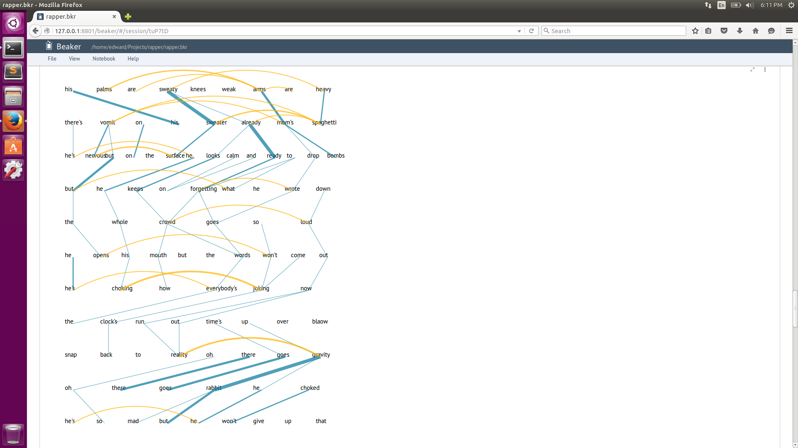

# RapGraph
Visualizing Rhymes in Raps with Genomic Algorithms and D3!

## About RapGraph

How can code help us understand what makes great raps? We built this app to find out.

RapGraph was built in beaker, using python for processing, and d3.js for visualization. Used nltk to translate word to phoneme (with cmudict). Implements Smith-Waterman alignment algorithm (typically used in genomics) to align phonemes from adjacent lines.



### Future Features
TTR: text to rap. Then the entire pipeline, for a rap battling robot.

## Use RapGraph Right Now!

Visit [www.RapGraph.me](http://www.rapgraph.me)

## Installation for Hacking
    git clone https://github.com/el2724/rapper.git rapGraph

### With Python

```
    pip install virtualenv
    virtualenv .
    source bin/activate
    pip install -r requirements.txt
    python webapp/app_rap.py
```

### With Beaker Notebook

[Beaker Notebook](http://beakernotebook.com/) is a program that lets you projects that combine 16+ different programming languages. You can open any of the `.bkr` files in the `research` folder if you have 


## External Links

- RapGraph at [YHack 2015](http://devpost.com/software/rapgraph)

## Dependencies
It is recommended to install dependencies using `pip`, the Python package manager. If you add external libraries, run
    pip freeze > requirements.txt

- Flask

